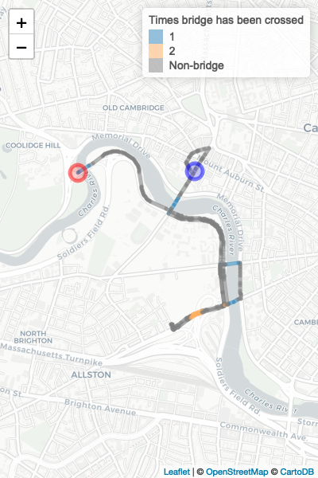

<!-- README.md is generated from README.Rmd. Please edit that file -->

# konigsbergr

[](https://travis-ci.org/dSHARP-CMU/konigsbergr)
[](https://ci.appveyor.com/project/dSHARP-CMU/konigsbergr)
[](https://codecov.io/github/dSHARP-CMU/konigsbergr?branch=master)

The goal of konigsbergr is to recreate the “Bridges of Königsberg”
problem over any city by converting data from OpenStreetMap into a graph
and traversing it.

## Installation

You can install the development version:

``` r
devtools::install_github("dSHARP-CMU/konigsbergr")
```

## Usage

Konigsbergr works with OSM data, transforming it into a graph object and
then using the \[pathfinder\] package to traverse edges within it.

``` r
library(konigsbergr)
#> Loading required package: geosphere
#> Loading required package: igraph
#> 
#> Attaching package: 'igraph'
#> The following objects are masked from 'package:stats':
#> 
#>     decompose, spectrum
#> The following object is masked from 'package:base':
#> 
#>     union
#> Loading required package: magrittr

boston_osm <- get_osm_bbox(xmin = -71.1383,
                           xmax = -71.1132,
                           ymin = 42.3592,
                           ymax = 42.3754)
#> Downloading...
#> complete!
#> Reading XML...complete!
#> Downloaded an OSM extract with 22939 nodes and 2809 ways.
boston_osm
#> osmar object
#> 22939 nodes, 2809 ways, 118 relations

boston_graph <- konigsberg_graph(boston_osm)
#> Creating base graph...complete!
#> Adding OSM attributes...complete!
#> Filtering graph to desired paths and bridges...complete!

boston_pathway <- cross_all_bridges(boston_graph)

view_konigsberg_path(boston_graph, boston_pathway)
```


