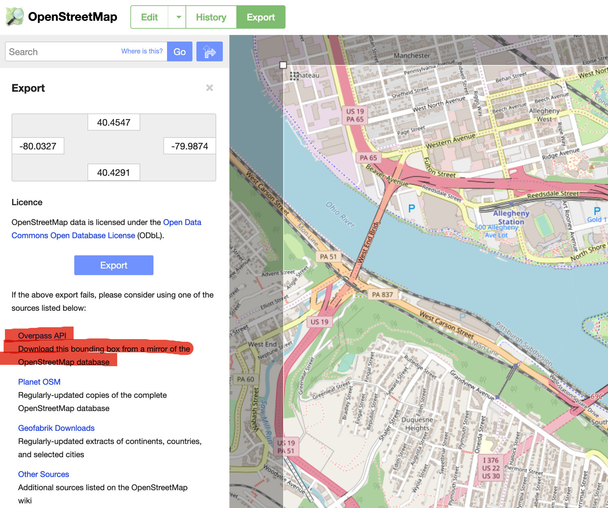

<!-- README.md is generated from README.Rmd. Please edit that file -->

# konigsbergr

[](https://travis-ci.org/dSHARP-CMU/konigsbergr)
[](https://ci.appveyor.com/project/dSHARP-CMU/konigsbergr)
[](https://codecov.io/github/dSHARP-CMU/konigsbergr?branch=master)

The goal of konigsbergr is to recreate the [“Bridges of
Königsberg”](https://en.wikipedia.org/wiki/Seven_Bridges_of_K%C3%B6nigsberg)
problem over any city by converting data from OpenStreetMap into a graph
and traversing it.

## Installation

You can install the development version:

``` r
devtools::install_github("dSHARP-CMU/konigsbergr")
```

## Usage

*For the complete manual, see [the package
vignette](dsharp-cmu.github.io/konigsbergr).*

Konigsbergr works with OSM data, transforming it into a graph object and
then using the [pathfinder](https://github.com/dSHARP-CMU/pathfinder/)
package to traverse edges within it.

``` r
library(konigsbergr)
```

An easy way to get an OSM data extract is to go to
<https://openstreetmap.org>, navigate to the region whose data you want
to download, and then use the “Export” tab to select a bounding box.
Click the “Overpass API” link to begin downloading a file.



You may then read the file into R:

``` r
city_osm <- get_osm_file("path/to/my/file")
```

Konigsbergr also provides a wrapper function `get_osm_bbox()` that lets
you download small-sized extracts of data from OSM by specifying minimum
and maximum latitudes and longitudes.

``` r
boston_osm <- get_osm_bbox(xmin = -71.1383,
                           xmax = -71.1132,
                           ymin = 42.3592,
                           ymax = 42.3754)
#> Downloading...complete!
#> Reading XML...Reading xml...done.
#> Finding ways...1101 found.
#> Collecting way attributes...done.
#> Collecting way tags...done.
#> Collecting way refs...done.
#> Finding relations...117 found.
#> Collecting relation attributes...done.
#> Collecting relation tags...done.
#> Collecting relation refs...done.
#> Identifying nodes...6308 nodes found.
#> Collecting node attributes...done.
#> Collecting node tags...done.
#> complete!
#> Downloaded an OSM extract with 6308 nodes and 1101 ways.
boston_osm
#> osmar object
#> 6308 nodes, 1101 ways, 117 relations

boston_graph <- konigsberg_graph(boston_osm)
#> Creating base graph...complete!
#> Adding OSM attributes...complete!
#> Filtering graph to desired paths and bridges...complete!

boston_pathway <- cross_all_bridges(boston_graph)

view_konigsberg_path(boston_graph, boston_pathway)
```

<!-- -->
